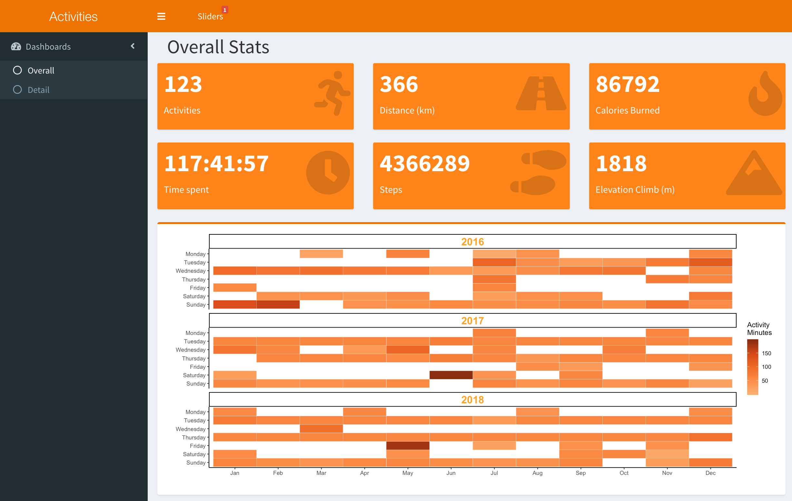

What better way to analyze your activities data from Apple Health and Runkeeper into R and generating some visualizations and counters. After that I will wrapping it together into a Shiny App. 

Want do I want to achieve for now?

- Number of activities, steps, kilometers ect.
- Heatmap of last X years number of activities colored by amount.

## Loading and have a look at the data
Export Runkeeper data, the option is available after login > account settings > export data > download your data.

For export and convert your Apple Health data follow my previous post [Analysing your Apple Health Data with Splunk](http://www.networkx.nl/data-science/visualising-health-data/).

```{r}
runkeeper <- read.csv("data/cardioActivities.csv", stringsAsFactors=FALSE)
steps <- read.csv("data/StepCount.csv", stringsAsFactors = FALSE)
dim(runkeeper)
dim(steps)
head(runkeeper)
head(steps)
str(runkeeper)
str(steps)
```

From the Runkeeper data we need `Date` and from Apple Health StepCount we need the `endDate` (thats when your step is done). Both has type `chr`. I could convert it as date, but I leave the data what it is and will do convert it when necessary.

## Create new variables
First we load the `lubridate` package.
```{r message=FALSE}
library(lubridate)
```

I will create some new variables and convert `Date` and `endDate` as Date so I can extract the year with the `year` function of the `lubridate` package.
```{r}
runkeeper$year <- year(as.Date(runkeeper$Date, origin = '1900-01-01')) 
steps$year <- year(as.Date(steps$endDate, origin = '1900-01-01')) 
summary(runkeeper$year)
summary(steps$year)
```

As you can see in the above summary of both dataframes, Runkeeper has more years than steps. That doesn't matter becouse we are now only looking for 2018 in the Shiny App and I will group it by year. In the app I create a year slider.

I will parse the period with hour, minuts ans seconds of the variable `Duration`. And I will calculate the duration in minutus. Some of the `Duration` variables has no leading zero for the hour and I cannot use it with the function `hms`. 

Add a leading zero if not exists.
```{r}
runkeeper$Duration[1:5]
runkeeper$Duration <- ifelse(nchar(runkeeper$Duration) < 6, 
                             paste0("0:", runkeeper$Duration), runkeeper$Duration)
runkeeper$Duration[1:5]
```

Now I can parse the `Duration` with `hms`.
```{r}
runkeeper$lub <- hms(runkeeper$Duration)
runkeeper$time_minutes <- hour(runkeeper$lub)*60 + 
  minute(runkeeper$lub) + 
  second(runkeeper$lub)/60
runkeeper$lub[1:5]
runkeeper$time_minutes[1:5]
```

## Group the data by year
First we load the package `dplyr`.
```{r message=FALSE}
library(dplyr)
```

Group both dataframes by year and do some summarises like count and sum of kilometers, climb, calories  and duration 
```{r}
grouped_runkeeper_year <- runkeeper %>%
  group_by(year) %>%
  summarise(cnt = n(), 
            km = sum(Distance..km.),
            climb = sum(Climb..m.),
            calories = sum(Calories.Burned),
            duration = sum(time_minutes, na.rm = TRUE))

grouped_steps_year <- steps %>%
  group_by(year) %>%
  summarise(cnt = sum(value))

grouped_runkeeper_year
grouped_steps_year
```

## Some simple visualizations
```{r}
library(ggplot2)
library(RColorBrewer)
grouped_runkeeper_year %>%
  ggplot(aes(x=year, y=cnt )) + 
  geom_bar(stat = "identity", col="white", fill="#ee8300") +
  geom_text(aes(label=cnt), hjust=1.2, color="white", size=3.5) +
  labs(x="", y="", title="Number activities by Year") + 
  scale_x_continuous(breaks=seq(min(grouped_runkeeper_year$year),
                                max(grouped_runkeeper_year$year),1)) + 
  coord_flip() +
  theme_bw()

grouped_steps_year %>%
  ggplot(aes(x=year, y=cnt )) + 
  geom_bar(stat = "identity", col="white", fill="#ee8300") +
  geom_text(aes(label=cnt), hjust=1.2, color="white", size=3.5) +
  labs(x="", y="", title="Number of Steps by Year") + 
  scale_x_continuous(breaks=seq(min(grouped_runkeeper_year$year),
                                max(grouped_runkeeper_year$year),1)) + 
  coord_flip() +
  theme_bw()
```

Add a heatmap of number of activities last 3 years from now.

```{r}
calendar_heatmap <- runkeeper %>% 
  select(Date,time_minutes,year) %>% 
  filter(year >= year(now()) - 3) %>%
  mutate(
    week = week(as.Date(Date)),
    wday = wday(as.Date(Date), week_start = 1),
    month = month(as.Date(Date), label = TRUE, abbr = TRUE),
    day = weekdays(as.Date(Date))
  )

cols <- rev(rev(brewer.pal(7,"Oranges"))[1:5])
     
calendar_heatmap %>%
  ggplot(aes(month, reorder(day, -wday), fill = time_minutes)) +
  geom_tile(colour = "white") +
  scale_fill_gradientn('Activity \nMinutes', colours = cols) +
  facet_wrap(~ year, ncol = 1) +
  theme_classic() +
  theme(strip.text.x = element_text(size = 16, face = "bold", colour = "orange")) +
  ylab("") + 
  xlab("")
```

## Screenshot



## SessionInfo
```{r}
sessionInfo()
```

Well wrap it up into a Shiny App which can be found on my GitHub.


