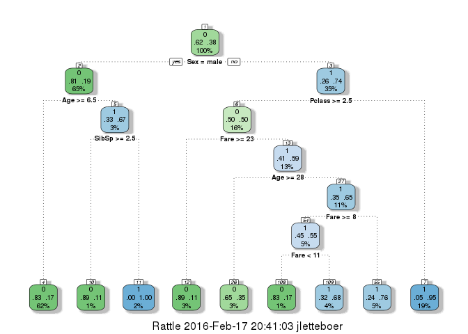
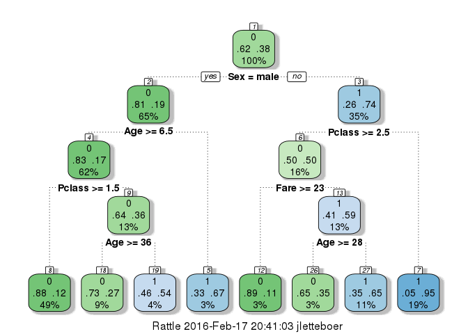

# Titanic - Machine Learning from Disaster (Part 1)
John Letteboer  
2/17/2016  
## Synopsis
In the challenge [Titanic - Machine Learning from Disaster](https://www.kaggle.com/c/titanic) from [Kaggle](https://www.kaggle.com), you need to predict of what kind of people were likely to survive the disaster or did not. In particular, they ask to apply the tools of machine learning to predict which passengers survived the tragedy.

I've split this up into two seperate parts.

**Part 1 - Data Exploration and basic Model Building**   
Part 2 - Creating own variables   

## Data Exploration
I've download the train and test data from [Kaggle](https://www.kaggle.com/c/titanic/data). At this page you could also find the variable descriptions.  

Import the training and testing set into R.

```r
train <- read.csv("train.csv")
test <- read.csv("test.csv")
```

Let's have a look at the data.

```r
summary(train)
```

```
##   PassengerId       Survived          Pclass     
##  Min.   :  1.0   Min.   :0.0000   Min.   :1.000  
##  1st Qu.:223.5   1st Qu.:0.0000   1st Qu.:2.000  
##  Median :446.0   Median :0.0000   Median :3.000  
##  Mean   :446.0   Mean   :0.3838   Mean   :2.309  
##  3rd Qu.:668.5   3rd Qu.:1.0000   3rd Qu.:3.000  
##  Max.   :891.0   Max.   :1.0000   Max.   :3.000  
##                                                  
##                                     Name         Sex           Age       
##  Abbing, Mr. Anthony                  :  1   female:314   Min.   : 0.42  
##  Abbott, Mr. Rossmore Edward          :  1   male  :577   1st Qu.:20.12  
##  Abbott, Mrs. Stanton (Rosa Hunt)     :  1                Median :28.00  
##  Abelson, Mr. Samuel                  :  1                Mean   :29.70  
##  Abelson, Mrs. Samuel (Hannah Wizosky):  1                3rd Qu.:38.00  
##  Adahl, Mr. Mauritz Nils Martin       :  1                Max.   :80.00  
##  (Other)                              :885                NA's   :177    
##      SibSp           Parch             Ticket         Fare       
##  Min.   :0.000   Min.   :0.0000   1601    :  7   Min.   :  0.00  
##  1st Qu.:0.000   1st Qu.:0.0000   347082  :  7   1st Qu.:  7.91  
##  Median :0.000   Median :0.0000   CA. 2343:  7   Median : 14.45  
##  Mean   :0.523   Mean   :0.3816   3101295 :  6   Mean   : 32.20  
##  3rd Qu.:1.000   3rd Qu.:0.0000   347088  :  6   3rd Qu.: 31.00  
##  Max.   :8.000   Max.   :6.0000   CA 2144 :  6   Max.   :512.33  
##                                   (Other) :852                   
##          Cabin     Embarked
##             :687    :  2   
##  B96 B98    :  4   C:168   
##  C23 C25 C27:  4   Q: 77   
##  G6         :  4   S:644   
##  C22 C26    :  3           
##  D          :  3           
##  (Other)    :186
```

```r
head(train,2)
```

```
##   PassengerId Survived Pclass
## 1           1        0      3
## 2           2        1      1
##                                                  Name    Sex Age SibSp
## 1                             Braund, Mr. Owen Harris   male  22     1
## 2 Cumings, Mrs. John Bradley (Florence Briggs Thayer) female  38     1
##   Parch    Ticket    Fare Cabin Embarked
## 1     0 A/5 21171  7.2500              S
## 2     0  PC 17599 71.2833   C85        C
```

```r
head(test,2)
```

```
##   PassengerId Pclass                             Name    Sex  Age SibSp
## 1         892      3                 Kelly, Mr. James   male 34.5     0
## 2         893      3 Wilkes, Mrs. James (Ellen Needs) female 47.0     1
##   Parch Ticket   Fare Cabin Embarked
## 1     0 330911 7.8292              Q
## 2     0 363272 7.0000              S
```

```r
dim(train)
```

```
## [1] 891  12
```

```r
dim(test)
```

```
## [1] 418  11
```

```r
str(train)
```

```
## 'data.frame':	891 obs. of  12 variables:
##  $ PassengerId: int  1 2 3 4 5 6 7 8 9 10 ...
##  $ Survived   : int  0 1 1 1 0 0 0 0 1 1 ...
##  $ Pclass     : int  3 1 3 1 3 3 1 3 3 2 ...
##  $ Name       : Factor w/ 891 levels "Abbing, Mr. Anthony",..: 109 191 358 277 16 559 520 629 417 581 ...
##  $ Sex        : Factor w/ 2 levels "female","male": 2 1 1 1 2 2 2 2 1 1 ...
##  $ Age        : num  22 38 26 35 35 NA 54 2 27 14 ...
##  $ SibSp      : int  1 1 0 1 0 0 0 3 0 1 ...
##  $ Parch      : int  0 0 0 0 0 0 0 1 2 0 ...
##  $ Ticket     : Factor w/ 681 levels "110152","110413",..: 524 597 670 50 473 276 86 396 345 133 ...
##  $ Fare       : num  7.25 71.28 7.92 53.1 8.05 ...
##  $ Cabin      : Factor w/ 148 levels "","A10","A14",..: 1 83 1 57 1 1 131 1 1 1 ...
##  $ Embarked   : Factor w/ 4 levels "","C","Q","S": 4 2 4 4 4 3 4 4 4 2 ...
```

```r
str(test)
```

```
## 'data.frame':	418 obs. of  11 variables:
##  $ PassengerId: int  892 893 894 895 896 897 898 899 900 901 ...
##  $ Pclass     : int  3 3 2 3 3 3 3 2 3 3 ...
##  $ Name       : Factor w/ 418 levels "Abbott, Master. Eugene Joseph",..: 210 409 273 414 182 370 85 58 5 104 ...
##  $ Sex        : Factor w/ 2 levels "female","male": 2 1 2 2 1 2 1 2 1 2 ...
##  $ Age        : num  34.5 47 62 27 22 14 30 26 18 21 ...
##  $ SibSp      : int  0 1 0 0 1 0 0 1 0 2 ...
##  $ Parch      : int  0 0 0 0 1 0 0 1 0 0 ...
##  $ Ticket     : Factor w/ 363 levels "110469","110489",..: 153 222 74 148 139 262 159 85 101 270 ...
##  $ Fare       : num  7.83 7 9.69 8.66 12.29 ...
##  $ Cabin      : Factor w/ 77 levels "","A11","A18",..: 1 1 1 1 1 1 1 1 1 1 ...
##  $ Embarked   : Factor w/ 3 levels "C","Q","S": 2 3 2 3 3 3 2 3 1 3 ...
```

The training set has **891** observations and **12** variables and the testing set has **418** observations and **11** variables. The traning set has **1** extra varible. Check which which one we are missing. I know we could see that in a very small dataset like this, but if its larger we want two compare them.


```r
colnames_check <- colnames(train) %in% colnames(test)
colnames(train[colnames_check==FALSE])
```

```
## [1] "Survived"
```

As we can see we are missing the `Survived` in the test set. Which is correct because thats our challenge, we must predict this by creating a model.

Let's look deeper into the training set, and check how many passengers that survived vs did not make it.

```r
table(train$Survived) 
```

```
## 
##   0   1 
## 549 342
```

Hmm oke, of the **891** there are only **342** who survived it. Check also as proportions.

```r
prop.table(table(train$Survived))
```

```
## 
##         0         1 
## 0.6161616 0.3838384
```

A little more than one-third of the passengers survived the disaster. Now see if there is a difference between males and females that survived vs males that passed away.

```r
table(train$Sex, train$Survived)
```

```
##         
##            0   1
##   female  81 233
##   male   468 109
```

```r
prop.table(table(train$Sex, train$Survived),margin = 1)
```

```
##         
##                  0         1
##   female 0.2579618 0.7420382
##   male   0.8110919 0.1889081
```

As we can see most of the female survived and most of the male did not make it.

## Model Building
After doing some exploratory analysis of the data, let's do some first prediction before getting deeper into the data.

### First prediction - All Female Survived
Create a copy of `test` to `test_female`, Initialize a `Survived` column to 0 and Set `Survived` to 1 if `Sex` equals "female"

```r
test_female <- test
test_female$Survived <- 0
test_female$Survived[test_female$Sex == "female"] <- 1
```

Create a data frame with two columns: PassengerId & Survived and write the solution away to a csv file.

```r
my_solution <- data.frame(PassengerId = test_female$PassengerId, Survived = test_female$Survived)
write.csv(my_solution, file =  "all_female.csv", row.names = FALSE)
```

That's our first submission to Kaggle and it's good for a score of **0.76555**. That's not so bad, but we want more!! :)

### Clean up the dataset
Now we need to clean the dataset to create our models. Note that it is important to explore the data so that we understand what elements need to be cleaned.
For example we have noticed that there are missing values in the data set, especially in the `Age` column of the training set. Show which columns have missing values in the training and test set.


```r
colSums(is.na(train))
```

```
## PassengerId    Survived      Pclass        Name         Sex         Age 
##           0           0           0           0           0         177 
##       SibSp       Parch      Ticket        Fare       Cabin    Embarked 
##           0           0           0           0           0           0
```

```r
colSums(is.na(test))
```

```
## PassengerId      Pclass        Name         Sex         Age       SibSp 
##           0           0           0           0          86           0 
##       Parch      Ticket        Fare       Cabin    Embarked 
##           0           0           1           0           0
```

As we can see we have missing values in `Age` in the training set and `Age`, `Fare` in the test set.

To tackle the missing values I'm going to predict the missing values with the full data set. First we need to combine the test and training set together.

```r
train2 <- train
test2 <- test
test2$Survived <- NA
full <- rbind(train2, test2)
```

First we tackle the missing `Fare`, because this is only one value. Let see in wich row it's missing. 

```r
full[!complete.cases(full$Fare),]
```

```
##      PassengerId Survived Pclass               Name  Sex  Age SibSp Parch
## 1044        1044       NA      3 Storey, Mr. Thomas male 60.5     0     0
##      Ticket Fare Cabin Embarked
## 1044   3701   NA              S
```

As we can see the passenger on row 1044 has an NA Fare value. Let's replace it with the median fare value.

```r
full$Fare[1044] <- median(full$Fare, na.rm = TRUE)
```

How to fill in missing `Age` values? We make a prediction of a passengers Age using the other variables and a decision tree model. 
This time we give method = "anova" since you are predicting a continuous variable.

```r
library(rpart)
predicted_age <- rpart(Age ~ Pclass + Sex + SibSp + Parch + Fare + Embarked,
                       data = full[!is.na(full$Age),], method = "anova")
full$Age[is.na(full$Age)] <- predict(predicted_age, full[is.na(full$Age),])
```

We know that the training set has 891 observations and the test set 418, we can split the data back into a train set and a test set. 

```r
train2 <- full[1:891,]
test2 <- full[892:1309,]
```

### Build a Decision Tree with rpart
Build the decision tree with rpart to predict `Survived` with the variables `Pclass`, `Sex`, `Age`, `SibSp`, `Parch`, `Fare` and `Embarked`.

```r
my_dt1 <- rpart(Survived ~ Pclass + Sex + Age + SibSp + Parch + Fare + Embarked, 
                     data = train2, 
                     method = "class")
```

Load in the packages to create a fancified visualized version of your tree.

```r
library(rattle)
library(rpart.plot)
library(RColorBrewer)
```

Visualize the decision tree using fancy tree of rpart.

```r
fancyRpartPlot(my_dt1)
```

 

From the top we can see that the node is voting 0, so at this level everyone would die. Below that we see that 62% of passengers die, while 38% survive (the most will die here that's why the node is voting that everyone die). If we go down to the male/female 81%/26% will die and 19%/74% will survive as the proportions exactly match those we find earlier. Let's see the proportions again rounded with two decimals.


```r
round(prop.table(table(train2$Survived)),2)
```

```
## 
##    0    1 
## 0.62 0.38
```

```r
round(prop.table(table(train2$Sex, train2$Survived),margin = 1),2)
```

```
##         
##             0    1
##   female 0.26 0.74
##   male   0.81 0.19
```

That are the same number's :)

Make the prediction using the test2 set.

```r
my_prediction <- predict(my_dt1, newdata = test2, type = "class")
```

Create a data frame with two columns: PassengerId & Survived. Survived contains your predictions.

```r
my_solution <- data.frame(PassengerId = test2$PassengerId, Survived = my_prediction)
```

Check that your data frame has 418 entries.

```r
nrow(my_solution)
```

```
## [1] 418
```

Write your solution to a csv file with the name my_dt1.csv.

```r
write.csv(my_solution, file =  "my_dt1.csv", row.names = FALSE)
```

This gives u a score of **0.77512**, this is a little better than our first submission.

Create a new decision tree `my_dt2` with some control aspects. The aspects are `cp` for splitting up of the decision tree stops and `minsplit` for the amount of observations in a bucket.

```r
my_dt2 <- rpart(Survived ~ Pclass + Sex + Age + SibSp + Parch + Fare + Embarked, 
                       data = train2, 
                       method = "class",
                       control = rpart.control(minsplit = 50, cp = 0))
```

Visualize your new decision tree.

```r
fancyRpartPlot(my_dt2)
```

 

Make the prediction using the `test2`, create the two column dataset, check the amount of rows and save it to `my_dt2.csv`.

```r
my_prediction <- predict(my_dt2, newdata = test2, type = "class")
my_solution <- data.frame(PassengerId = test2$PassengerId, Survived = my_prediction)
nrow(my_solution)
```

```
## [1] 418
```

```r
write.csv(my_solution, file =  "my_dt2.csv", row.names = FALSE)
```

This will gives us a score of **0.74163**. Oke this is not an improvement.  

In part two I will create my own variables for making a model.

