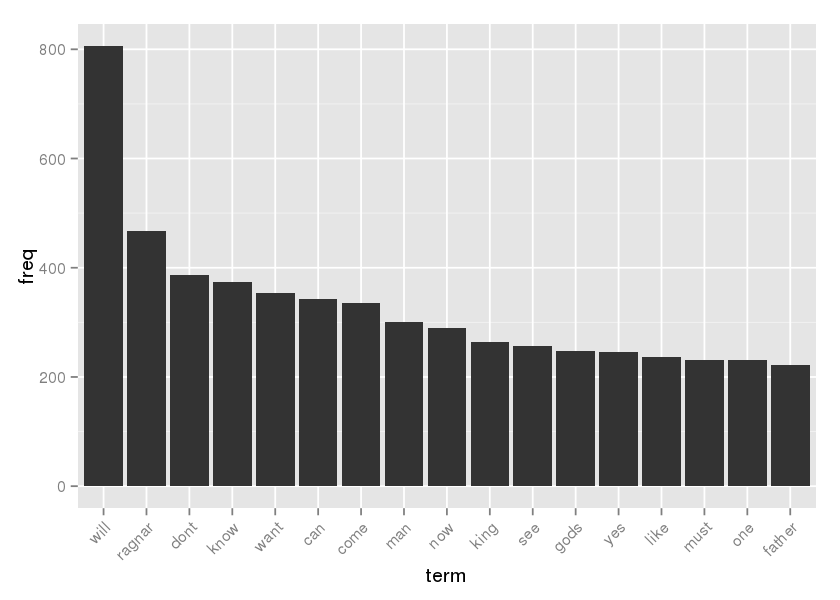
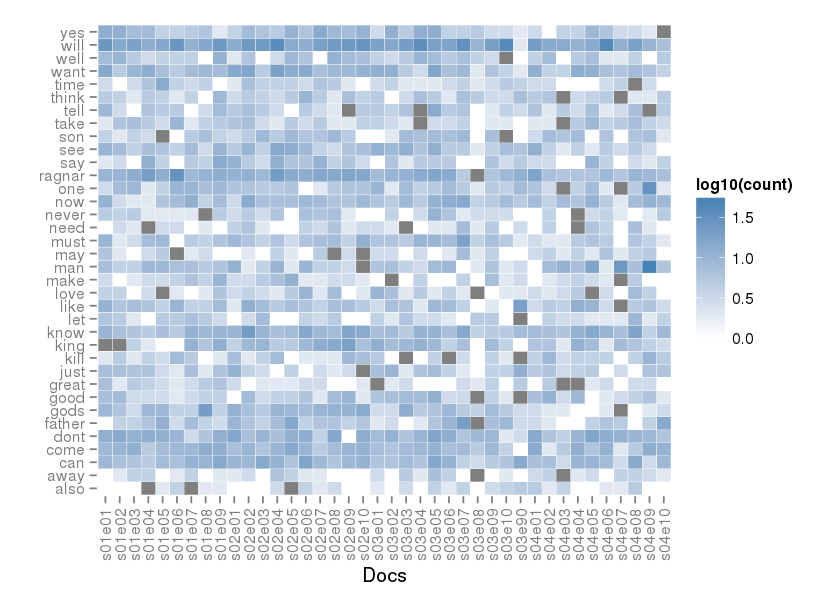
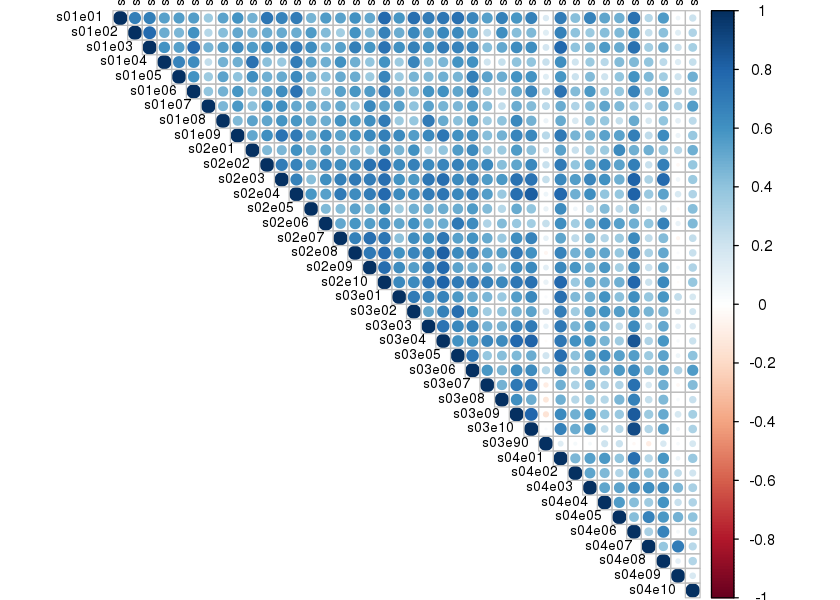
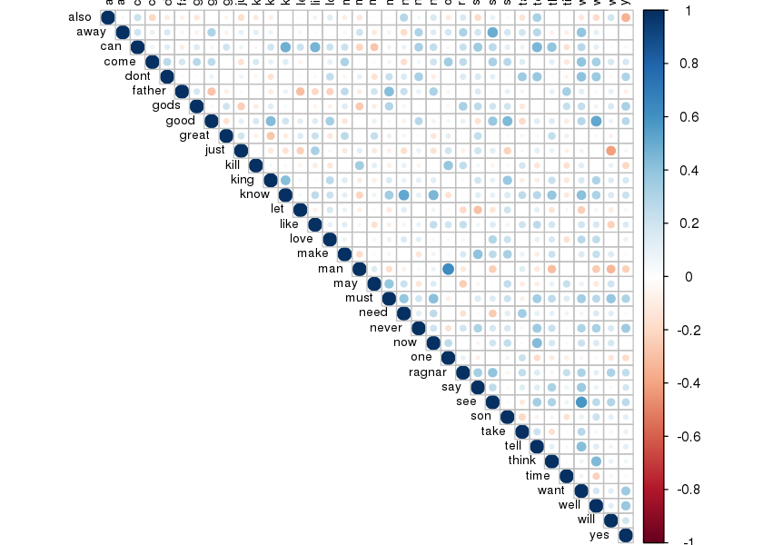

# Text Mining with R on Vikings episode scripts
John Letteboer  
5 July 2016  
### Synopsis
I'm a hugh fan of the TV show Vikings. I thought it would be cool to mine the tv shows scripts to figure out which terms are the most used in the show and what the correlations are between the most frequent terms and episodes.

Who do not know this serie here is some information of [Vikings](http://www.thetvdb.com/?tab=series&id=260449&lid=7)

### Getting the data
Before we can start we need to get the data. I have found a website with a lots of tv and movie scripts. All the scripts are embed in HTML code that we must extract. R has a package rvest for this and we will use it to get our data.

Rvest is a library that easily harvest (Scrape) web pages [rvest](https://cran.r-project.org/web/packages/rvest/index.html).


```r
# Loading the required libraries
library(rvest)
```

```
## Loading required package: xml2
```

The script is written as we can harvest another tv show if we want only with setting it to another tv show. 

Setting our variables, such as, which tv show we want, download directory, base urls etc.


```r
# Which tv show, if you want another show, first check on the website which tv show url is used. 
tvshow <- "vikings"

# Creating download directory and change to it
directory = paste("~/Data Analysis/files/", tvshow, sep="")
dir.create(directory, recursive = TRUE, showWarnings = FALSE)
setwd(directory)

# Setting base url and complte url
baseurl <- "http://www.springfieldspringfield.co.uk/"
url <- paste(baseurl,"episode_scripts.php?tv-show=", tvshow, sep="")
```

There are 4 seasons with 10 episodes each of Vikings, it do not want to scrape it piece by peice, so first we scrape all episode urls before we can downloding the scripts. Before that we need to explorer the websites source for which nodes to select.  

Go to the urls you want to scrape, in my case [this](http://www.springfieldspringfield.co.uk/episode_scripts.php?tv-show=vikings). In case of a Chrome browser right click the first epidose of season 1 and select inspect. You wil see the following:


As you can see after the tag ```<h3>``` the first href tag of s01e01 with the class ```class="season-episode-title"```. This class we need to select as our node.


```r
# read the HTML page
scrape_url <- read_html(url)
# node selector
s_selector <- ".season-episode-title"

# scrape href nodes in .season-episode-title
all_urls_season <- html_nodes(scrape_url, s_selector) %>%
  html_attr("href")
```

Show some structure of the all_url_seasons.

```r
str(all_urls_season)
```

```
##  chr [1:40] "view_episode_scripts.php?tv-show=vikings&episode=s01e01" ...
```

```r
head(all_urls_season)
```

```
## [1] "view_episode_scripts.php?tv-show=vikings&episode=s01e01"
## [2] "view_episode_scripts.php?tv-show=vikings&episode=s01e02"
## [3] "view_episode_scripts.php?tv-show=vikings&episode=s01e03"
## [4] "view_episode_scripts.php?tv-show=vikings&episode=s01e04"
## [5] "view_episode_scripts.php?tv-show=vikings&episode=s01e05"
## [6] "view_episode_scripts.php?tv-show=vikings&episode=s01e06"
```

```r
tail(all_urls_season)
```

```
## [1] "view_episode_scripts.php?tv-show=vikings&episode=s04e05"
## [2] "view_episode_scripts.php?tv-show=vikings&episode=s04e06"
## [3] "view_episode_scripts.php?tv-show=vikings&episode=s04e07"
## [4] "view_episode_scripts.php?tv-show=vikings&episode=s04e08"
## [5] "view_episode_scripts.php?tv-show=vikings&episode=s04e09"
## [6] "view_episode_scripts.php?tv-show=vikings&episode=s04e10"
```

As we can see in the structure display we have 40 urls of the episodes. Now we have all variables and season urls, we can harvest the scripts and save them to seperate text files for doing our text mining.


```r
# Loop through all season urls 
for (i in all_urls_season) {
  uri <- read_html(paste(baseurl, i, sep="/"))
  # same thing here first check which node we need to select, so forst do a inspect of the site
  script_selector <- ".scrolling-script-container"
  # scrape all script text to a variable
  text <- html_nodes(uri, script_selector) %>% 
    html_text()
  
  # Get last five characters of all_urls_season as season for saving this to seperate text files
  substrRight <- function(x, n) {
    substr(x, nchar(x)-n+1, nchar(x))
  }
  seasons <- substrRight(i, 5)
  # Write each script to a seperate text file
  write.csv(text, file = paste(directory, "/", tvshow, "_", seasons, ".txt", sep=""), row.names = FALSE)
}
```

### Starting with Text Mining
Now that we have all Viking episode scripts we can do some text mining with the tm library.


```r
# load library
library(tm)
```

```
## Loading required package: NLP
```

```r
# set filepath to scripts
cname <- file.path(directory)
# see if the filepath contains our scripts
(docname <- dir(cname))
```

```
##  [1] "vikings_01e01.txt" "vikings_01e02.txt" "vikings_01e03.txt"
##  [4] "vikings_01e04.txt" "vikings_01e05.txt" "vikings_01e06.txt"
##  [7] "vikings_01e07.txt" "vikings_01e08.txt" "vikings_01e09.txt"
## [10] "vikings_02e01.txt" "vikings_02e02.txt" "vikings_02e03.txt"
## [13] "vikings_02e04.txt" "vikings_02e05.txt" "vikings_02e06.txt"
## [16] "vikings_02e07.txt" "vikings_02e08.txt" "vikings_02e09.txt"
## [19] "vikings_02e10.txt" "vikings_03e01.txt" "vikings_03e02.txt"
## [22] "vikings_03e03.txt" "vikings_03e04.txt" "vikings_03e05.txt"
## [25] "vikings_03e06.txt" "vikings_03e07.txt" "vikings_03e08.txt"
## [28] "vikings_03e09.txt" "vikings_03e10.txt" "vikings_03e90.txt"
## [31] "vikings_04e01.txt" "vikings_04e02.txt" "vikings_04e03.txt"
## [34] "vikings_04e04.txt" "vikings_04e05.txt" "vikings_04e06.txt"
## [37] "vikings_04e07.txt" "vikings_04e08.txt" "vikings_04e09.txt"
## [40] "vikings_04e10.txt"
```

```r
# Crete a Corpus of the text files so we can do some analysis
docs <- Corpus(DirSource(cname), readerControl = list(id=docname))
# Show summary of the Corpus, we have 40 document in our Corpus
summary(docs)
```

```
##                   Length Class             Mode
## vikings_01e01.txt 2      PlainTextDocument list
## vikings_01e02.txt 2      PlainTextDocument list
## vikings_01e03.txt 2      PlainTextDocument list
## vikings_01e04.txt 2      PlainTextDocument list
## vikings_01e05.txt 2      PlainTextDocument list
## vikings_01e06.txt 2      PlainTextDocument list
## vikings_01e07.txt 2      PlainTextDocument list
## vikings_01e08.txt 2      PlainTextDocument list
## vikings_01e09.txt 2      PlainTextDocument list
## vikings_02e01.txt 2      PlainTextDocument list
## vikings_02e02.txt 2      PlainTextDocument list
## vikings_02e03.txt 2      PlainTextDocument list
## vikings_02e04.txt 2      PlainTextDocument list
## vikings_02e05.txt 2      PlainTextDocument list
## vikings_02e06.txt 2      PlainTextDocument list
## vikings_02e07.txt 2      PlainTextDocument list
## vikings_02e08.txt 2      PlainTextDocument list
## vikings_02e09.txt 2      PlainTextDocument list
## vikings_02e10.txt 2      PlainTextDocument list
## vikings_03e01.txt 2      PlainTextDocument list
## vikings_03e02.txt 2      PlainTextDocument list
## vikings_03e03.txt 2      PlainTextDocument list
## vikings_03e04.txt 2      PlainTextDocument list
## vikings_03e05.txt 2      PlainTextDocument list
## vikings_03e06.txt 2      PlainTextDocument list
## vikings_03e07.txt 2      PlainTextDocument list
## vikings_03e08.txt 2      PlainTextDocument list
## vikings_03e09.txt 2      PlainTextDocument list
## vikings_03e10.txt 2      PlainTextDocument list
## vikings_03e90.txt 2      PlainTextDocument list
## vikings_04e01.txt 2      PlainTextDocument list
## vikings_04e02.txt 2      PlainTextDocument list
## vikings_04e03.txt 2      PlainTextDocument list
## vikings_04e04.txt 2      PlainTextDocument list
## vikings_04e05.txt 2      PlainTextDocument list
## vikings_04e06.txt 2      PlainTextDocument list
## vikings_04e07.txt 2      PlainTextDocument list
## vikings_04e08.txt 2      PlainTextDocument list
## vikings_04e09.txt 2      PlainTextDocument list
## vikings_04e10.txt 2      PlainTextDocument list
```

```r
# Inspect the first document, it has 12958 characters
#inspect(docs[1])
```

There is a lot of information in the script we do not need and is not useful for text mining. We need to clean it up. We remove all numbers, convert text to lowercase, remove punctuation and stopwords, in this case english.


```r
docs <- tm_map(docs, tolower)
docs <- tm_map(docs, removePunctuation)
docs <- tm_map(docs, removeNumbers)
docs <- tm_map(docs, removeWords, stopwords("english"))
```

Now we will perform stemming, a stem is a form to which affixes can be attached. An example of this is wait, waits, waited, waiting, all of them are common to wait. 


```r
library(SnowballC)
docs <- tm_map(docs, stemDocument)
```

We have removed a lot of characters which resulted in a lot of whitespaces, we remove this also.


```r
docs <- tm_map(docs, stripWhitespace)
```

Let's have a look to our first document.


```r
#inspect(docs[1])
```

We are ready with preprosessing the data and turn the document back as plain text documents.

```r
docs <- tm_map(docs, PlainTextDocument)
```

Create a Term Document Matrix of our documents. Which reflects the number of times each term in the corpus is found in each of the documents. And add some readable columnnmes.


```r
# Create a tdm
tdm <- TermDocumentMatrix(docs)
# Add readable columnnames, in our case the document filename
docname <- gsub("vikings_", "",docname)
docname <- gsub(".txt", "",docname)
docname <- paste("s",docname, sep="")
colnames(tdm) <- docname
# Show and inspect the tdm
tdm
```

```
## <<TermDocumentMatrix (terms: 5608, documents: 40)>>
## Non-/sparse entries: 22220/202100
## Sparsity           : 90%
## Maximal term length: 17
## Weighting          : term frequency (tf)
```

```r
inspect(tdm[1:10,1:6])
```

```
## <<TermDocumentMatrix (terms: 10, documents: 6)>>
## Non-/sparse entries: 2/58
## Sparsity           : 97%
## Maximal term length: 10
## Weighting          : term frequency (tf)
## 
##             Docs
## Terms        s01e01 s01e02 s01e03 s01e04 s01e05 s01e06
##   abandon         0      0      0      0      0      0
##   abandoned       0      0      0      0      0      0
##   abandoning      0      0      0      0      0      0
##   abandons        0      0      0      0      0      0
##   abbot           0      0      0      1      0      0
##   abdication      0      0      0      0      0      0
##   abed            0      0      0      0      0      0
##   abide           0      0      0      0      0      0
##   abl             0      0      0      0      0      0
##   able            0      0      0      0      0      1
```

Do the same for a Document Term Matrix (this is a transpose of a tdm)


```r
dtm <- DocumentTermMatrix(docs)
rownames(dtm) <- docname
dtm
```

```
## <<DocumentTermMatrix (documents: 40, terms: 5608)>>
## Non-/sparse entries: 22220/202100
## Sparsity           : 90%
## Maximal term length: 17
## Weighting          : term frequency (tf)
```

```r
inspect(dtm[1:10,1:6])
```

```
## <<DocumentTermMatrix (documents: 10, terms: 6)>>
## Non-/sparse entries: 2/58
## Sparsity           : 97%
## Maximal term length: 10
## Weighting          : term frequency (tf)
## 
##         Terms
## Docs     abandon abandoned abandoning abandons abbot abdication
##   s01e01       0         0          0        0     0          0
##   s01e02       0         0          0        0     0          0
##   s01e03       0         0          0        0     0          0
##   s01e04       0         0          0        0     1          0
##   s01e05       0         0          0        0     0          0
##   s01e06       0         0          0        0     0          0
##   s01e07       0         0          0        0     0          0
##   s01e08       0         0          0        0     0          0
##   s01e09       0         0          0        0     0          0
##   s02e01       1         0          0        0     0          0
```

Now we have done that we can ask questions about, what are de most frequently terms in the scripts and what are the associations between terms.

### Term frequency
Let have a look of the most frequently terms first and show the top 20.


```r
freq <- sort(colSums(as.matrix(dtm)), decreasing=TRUE)
head(freq,20)
```

```
##   will ragnar   dont   know   want    can   come    man    now   king 
##    806    467    387    373    354    342    335    300    290    264 
##    see   gods    yes   like   must    one father   well    god    son 
##    256    247    245    237    231    231    221    193    191    187
```


### Plotting the terms frequencies
Add is to a data frame so we can plot it and show the top 20.


```r
tf <- data.frame(term=names(freq), freq=freq)   
head(tf,20)  
```

```
##          term freq
## will     will  806
## ragnar ragnar  467
## dont     dont  387
## know     know  373
## want     want  354
## can       can  342
## come     come  335
## man       man  300
## now       now  290
## king     king  264
## see       see  256
## gods     gods  247
## yes       yes  245
## like     like  237
## must     must  231
## one       one  231
## father father  221
## well     well  193
## god       god  191
## son       son  187
```

Let's plot it.

```r
# descending sort of teh tf by freq
tf$term <- factor(tf$term, levels = tf$term[order(-tf$freq)])
library(ggplot2)
```

```
## 
## Attaching package: 'ggplot2'
## 
## The following object is masked from 'package:NLP':
## 
##     annotate
```

```r
p <- ggplot(subset(tf, freq>200), aes(term, freq))    
p <- p + geom_bar(stat="identity")   
p <- p + theme(axis.text.x=element_text(angle=45, hjust=1))   
p
```

 

The most frequent term is ```will```, after that is the main actor ```ragnar```.

### Further Analysis
As we can see in our first look at the tdm, we have a lot op sparse terms in our documents (90%). That is a lot, lets remove these.


```r
tdm.common = removeSparseTerms(tdm, sparse = 0.1)
tdm
```

```
## <<TermDocumentMatrix (terms: 5608, documents: 40)>>
## Non-/sparse entries: 22220/202100
## Sparsity           : 90%
## Maximal term length: 17
## Weighting          : term frequency (tf)
```

```r
tdm.common
```

```
## <<TermDocumentMatrix (terms: 36, documents: 40)>>
## Non-/sparse entries: 1391/49
## Sparsity           : 3%
## Maximal term length: 6
## Weighting          : term frequency (tf)
```

That is a 87% less sparsity. See how many terms we had and now have.


```r
dim(tdm)
```

```
## [1] 5608   40
```

```r
dim(tdm.common)
```

```
## [1] 36 40
```

Hmm from 5608 terms to only 36 terms, we inspect the first 10 terms of the first 6 documents.


```r
inspect(tdm.common[1:10,1:6])
```

```
## <<TermDocumentMatrix (terms: 10, documents: 6)>>
## Non-/sparse entries: 59/1
## Sparsity           : 2%
## Maximal term length: 6
## Weighting          : term frequency (tf)
## 
##         Docs
## Terms    s01e01 s01e02 s01e03 s01e04 s01e05 s01e06
##   also        1      1      1      0      2      4
##   away        1      2      4      4      1      2
##   can         9      7      6      5      8      7
##   come        9     10     12      5      8      9
##   dont       12     14     11     13     12     10
##   father      1      4      4      6     12      3
##   gods        9      6      3      9      9      4
##   good        7      8      3      3      3      2
##   great       7      2      5      4      3      2
##   just        7      7      6      6      3      2
```

Let visualize these most common terms in a heatmap with ggplot. As ggplot works with a matrix we need to convert the ```tdm.comon``` to a matrix because the tdm is a spare matrix.

```r
tdm.dense <- as.matrix(tdm.common)
dim(tdm.dense)
```

```
## [1] 36 40
```

We need the data as a normal matrix in order to produce the visualisation. 

```r
library(reshape2)
tdm.dense.m <- melt(tdm.dense, value.name = "count")
head(tdm.dense.m)
```

```
##    Terms   Docs count
## 1   also s01e01     1
## 2   away s01e01     1
## 3    can s01e01     9
## 4   come s01e01     9
## 5   dont s01e01    12
## 6 father s01e01     1
```

Make the heatmap visualization.

```r
library(ggplot2)
ggplot(tdm.dense.m, aes(x = Docs, y = Terms, fill = log10(count))) +
     geom_tile(colour = "white") +
     scale_fill_gradient(high="steelblue" , low="white")+
     ylab("") +
     theme(panel.background = element_blank()) +
     theme(axis.text.x = element_text(angle = 90, hjust = 1, vjust = 0.5))
```

 

Okay what have we here? Now we can check which common terms are used in which season and episode of Vikings. The term ```will``` is common used in the most episodes excepts in s03e90. That's a strange episode, isn't it? (I've look that up, it no realy an episode it's a documentary of Vikings :) )

Now we plot a correlogram of the episodes.

Note: Correlogram is a graph of correlation matrix. It is very useful to highlight the most correlated variables in a data table. In this plot, correlation coefficients is colored according to the value. Correlation matrix can be also reordered according to the degree of association between variables. 

```r
corr <- cor(tdm.dense)
library(corrplot)
corrplot(corr, method = "circle", type = "upper", tl.col="black", tl.cex=0.7)
```

 

Transpose the tdm.dense so we can plot a correlogram of the terms.

```r
tdm.dense.t <- t(tdm.dense)
corr.t <- cor(tdm.dense.t)
corrplot(corr.t,method = "circle", type = "upper", tl.col="black", tl.cex=0.7)
```

 

Well we can do a lot more analysis, mining and visualisations, this is it for now.
